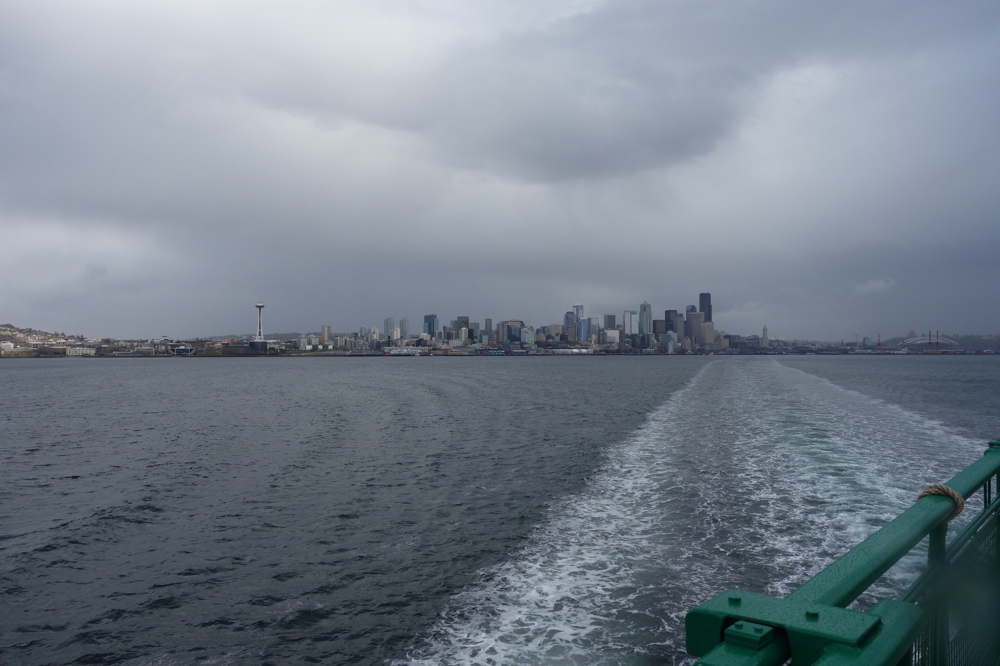
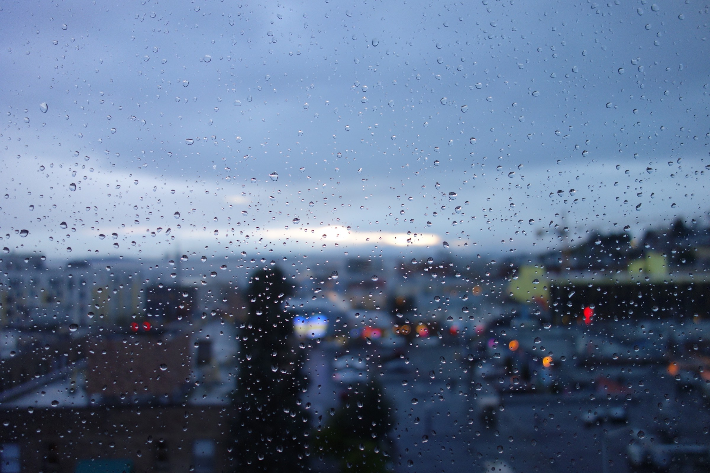
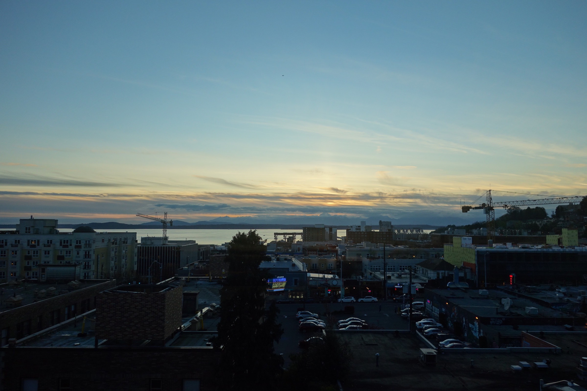
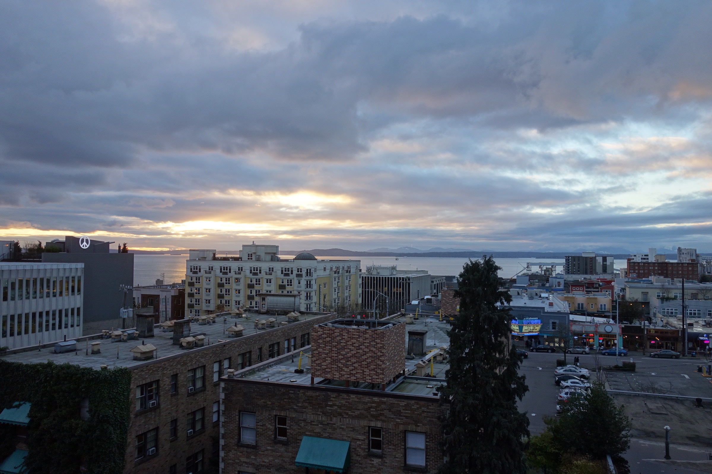

# End of Year Review - 2016

I’ve just returned from a short ride up north, near some beach in Shoreline. The skies were pale blue and slightly overcast, and it was chilly enough that the air pinched my ears but wasn’t enough to be miserable. I think the crisp wind brightened my mind because when I got back I had the immediate sense that it would be a good time to write about the past year.

If last year was about change and transitions, this year was about settling and growth. In the past year, I’ve made Seattle my home — not just a place I live in, but a place I feel truly in love with, a place where I run into friends on the street.

## What I’ve Done

Bought my first motorcycle. Riding is at once thrilling and calming, a perfect release from daily stresses and a wonderful way to explore the areas surrounding the city.

Improved my Japanese speaking, reading, and writing skills considerably, certainly better than I’ve ever been in the past. Although I spoke some around the home with my mother since I was young, I didn’t have many Japanese friends and never spoke much outside of that context. In Seattle, I have a bunch of Japanese speaking friends, and I’ve also self-studied with vocabulary tools like [WaniKani] and grammar resources like [Tae Kim’s guide].

Consistently exercised. I’ve had bouts of gym going and running in the past, but outside of highschool sports I never had a steady (1 month+) exercise routine. I’ve tried to exercise regularly many times in the past but had always flaked out a few weeks in, and I attribute my current success to 1) having a partially forced schedule due to work and 2) having a gym in my apartment. It was certainly difficult at first, but the best benefit I’ve seen from this habit is increased energy and self-discipline. Even though working out or running draings energy immediately, in the long term it seems to increase the amount of stamina and self-control I have. I’m sure there’s combined biological and psycholgical reasons behind this, but it’s something I’ve never really experienced before and it’s wonderful.

Grown as a developer. My work at Inkstone is both challenging and fun and I’m grateful to be working with the people there. I’ve had the opportunity to launch some ridiculously cool stuff and take on increasing levels of responsibility with my projects. My actual coding and problem solving skills have improved by massive amounts since last year and I’ve also been able to learn more about good architecture and proper high-level structuring of larger projects.

Budgeted. I know, I know, what a boring thing to note in a yearly review, but this is my first full year as an “adult” and properly handling my finances is important for my future. Thanks to my parent’s thifty spending habits, a lot of good budgeting practices came fairly naturally. While I haven’t had issues paying rent or credit card bills, I didn’t like how wishy-washy I dealt with spending and in the past month I’ve started using a system called [You Need a Budget] to more concretely track my money. I’ll see how it works in the next few months, but so far it seems great!

## What I Want to Do

Film! I watched a lot of amazing movies this year (The Revenant, Sicario, Victoria, Arrival), and I’ve become enamored with film as an art form. While my love for literature, music, and other media hasn’t diminished at all, I really want to try my hand at film in this upcoming year. I’ve had a lot of moments recently where I’ll see or hear something beautiful and immediately think *this needs to be preserved, I can’t be the only one to experience this.* In a sense, that’s what film is to me: conveying a bit of life exactly how you felt it or imagined it.

Meditate. While I’ve done this a bit alongside my exercising, it hasn’t been nearly as consistent. There’s a [crazy amount of research] describing the positive effects of mindfulness on just about every aspect of life and it makes no sense to not build a habit of something that only takes a few minutes each day. I’ve been using the [Headspace] app on and off for a bit but hope to make it a steady habit in 2017.

Diversify my income. Ever since I earned my first $100 from Google Adsense in highschool, it’s blown my mind that you can seemingly generate money out of thin air on the internet. Building some form of online business in my spare time is a primary goal of mine in 2017. The freedom and opportunity that comes from managing your own income stream (especially if it’s partially or completely passive) is amazing and opens many doors for alternate careers down the road. Imagine having your basic living costs covered from a few hours of work a week, you could choose any career or work based solely on interest! What a luxury. I’m under no delusion that this is an easy (or even achievable) goal, but I’ve toyed with this enough in the past to know it’s possible. I think a good goal would be to be earning a few hundred a month by the end of the year. Resources like Glenn Allsopp’s [Viperchill] and his newly launched [Gaps] site will be my guide.

Read more. I read a large amount online but there’s something to be said for spending more time and thought on long-form articles or standard novels and books. I devoured [Blake Crouch’s *Dark Matter*] in two days while back in DC for the holidays, and while I don’t consider it a particularly well written book it was certainly very entertaining. It’s been too long since I’ve gotten completely lost in a really good book and I believe my mind and imagination are lacking for it.
